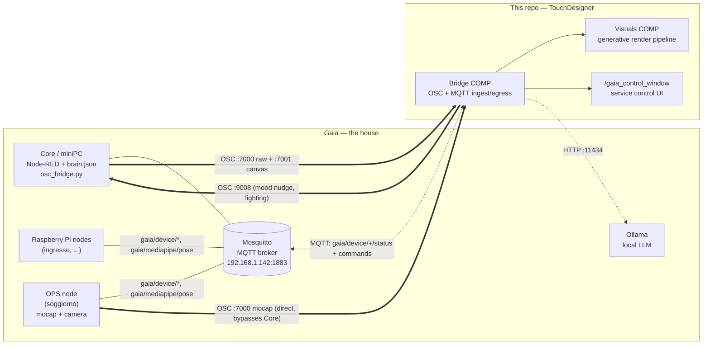
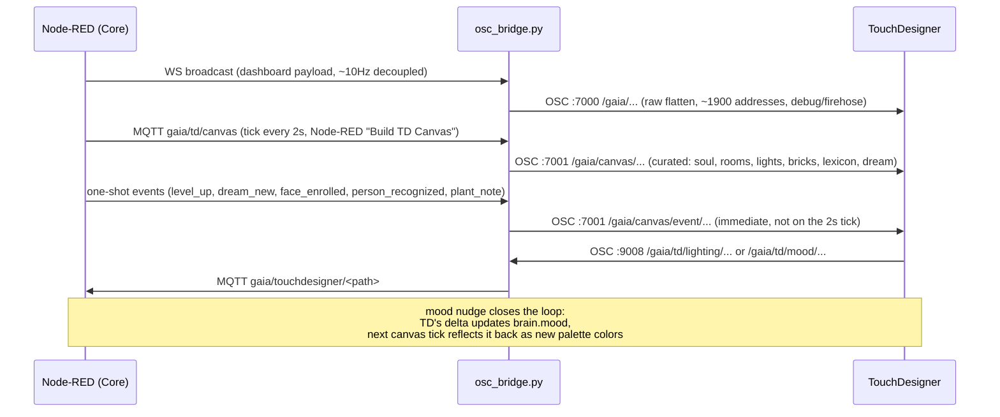
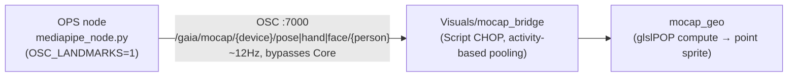
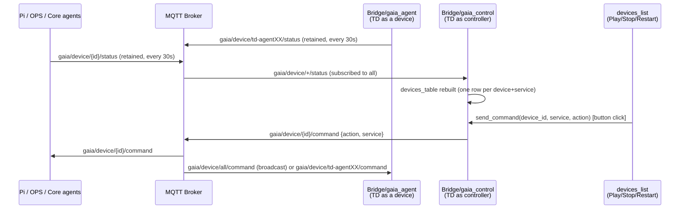
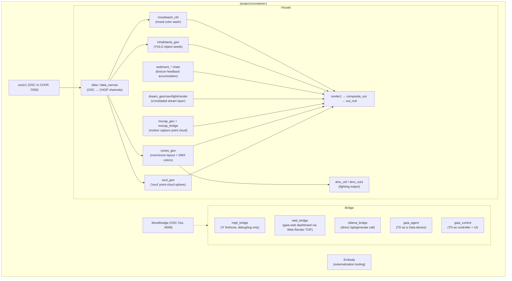

# TD4Gaia — Architecture

TouchDesigner project that turns **Gaia** — a distributed home-intelligence system (sensors, cameras, an LLM-driven "soul"/mood, a dream layer) — into real-time generative visuals, lighting (DMX) and a live device-control panel. Built and version-controlled with **Embody** (externalizes the network to git-diffable files) and **Envoy** (an MCP server that lets an AI agent inspect and edit the live TD network directly).

Gaia itself lives outside this repo: Node-RED orchestrator + `brain.json` state, a Mosquitto MQTT bus, Ollama (local LLM), Raspberry Pi / OPS / Core nodes running cameras, MediaPipe, YOLO. TD talks to it exclusively over the network (OSC + MQTT) — no shared filesystem, no direct code dependency.

## 1. System context

Three independent channels share the same OSC port (7000) but never collide — TD tells them apart purely by address prefix (`/gaia/...` vs `/gaia/mocap/...`).

| # | Channel | Direction | Transport | Purpose |
|---|---|---|---|---|
| 1 | Bridge (osc_bridge.py on Core) | Gaia → TD | OSC :7000 (raw flatten) + :7001 (curated canvas) | House state: mood, rooms, lights, people, lexicon, one-shot events |
| 1 | Bridge (osc_bridge.py on Core) | TD → Gaia | OSC :9008 → MQTT `gaia/touchdesigner/...` | Lighting control, mood nudges (deltas) |
| 2 | Mocap direct | OPS → TD | OSC :7000, `/gaia/mocap/...` namespace | High-frequency raw landmarks (pose/hands/face), bypasses Core entirely |
| 3 | Device protocol | TD ↔ Broker | MQTT `gaia/device/{id}/status`\|`command` | Service-plane only — presence, enable/disable/restart, **not** data |

**Design rule** (confirmed against Gaia's own `GAIA_TD_INTEGRATION.md`): **OSC is the data plane, MQTT is the service plane.** TD never subscribes to raw Gaia data over MQTT — everything that drives visuals arrives over OSC through the Core bridge. The one deliberate exception is channel 3, which has no OSC equivalent by design.

## 2. Channel 1 detail — OSC Bridge

Landed in TD as `oscin1` (raw, port 7000) feeding `Visuals/data`, and a dedicated OSC In DAT (port 7001) feeding `Visuals/data_canvas` — kept separate because the curated feed mixes text (mood name, room activity, colors) with numbers, which a numeric-only OSC In CHOP can't carry. `/project1/container1/MoodNudge` sends the TD → Gaia mood deltas.

## 3. Channel 2 detail — Mocap direct

Person-indexed (`person_id` consistent across pose/hand/face within one frame, best-effort by lateral position — not a persistent identity). Pooled defensively per body part (pose/hands: top-N by activity; face: **fixed per-region budget**, since pooling the whole face by activity let one busy region — e.g. lips while talking — starve the rest).

## 4. Channel 3 detail — Device protocol (service plane)

Both `gaia_agent` and `gaia_control` use raw `paho.mqtt.client` (not TD's native MQTT Client DAT). Both follow the same hard-won thread-safety pattern: **worker threads (paho's network thread, a heartbeat/staleness thread) touch only a `queue.Queue`; an Execute DAT's `onFrameStart` drains it on the main thread** — TD raises `tdError` if `run()` or any operator/parameter access happens off the main thread. `gaia_startup` (project root, outside Embody's tracked tree) fires `onStart` at real TD launch; the in-tree lifecycle DATs use `onCreate` for same-session recreation (a `.tox` "Start" toggle does not survive Embody's externalization roundtrip — a project-specific gotcha, not a TD limitation).

## 5. TouchDesigner network map

Six generative features, each independently controllable and DMX/composite-linked: **mood color** (`moodwash_*`), **object inhabitants** (`inhabitants_geo`, FNV-1a seeded — same word/class always draws the same way), **DMX lighting** (`dmx_*`, mirrors real house state or the on-screen zone colors), **dream sequence** (`dream_*`, crossfaded secondary render), **level-up bang** (`envelope_levelup`), **lexicon sediment** (`sediment_*`, a feedback-accumulated visual memory of Gaia's vocabulary).

## 6. Dev tooling — Embody + Envoy

- **Embody** externalizes COMPs/DATs to git-diffable files (`.tox`, `.py`, `.glsl`, `.tsv`) tracked in `externalizations.tsv`, and strips/restores the live network around `project.save()`. One hard rule learned the hard way: **never nest an independently-externalized `.tox` inside another tracked `.tox`** — it loses its contents on reload. Keep one tox level per subtree.
- **Envoy** runs an MCP server inside TD (port 9870) so an AI agent can query and mutate the live network directly — used to build and debug everything in `Bridge/`.
- Git LFS tracks `*.toe`/`*.tox` (binary); `Backup/`, `TDImportCache/`, `.tdn_backup/`, `.venv/`, `logs/` are regenerated locally and gitignored — git history replaces Embody's own local numbered-`.toe` backups.
